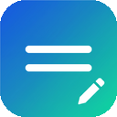
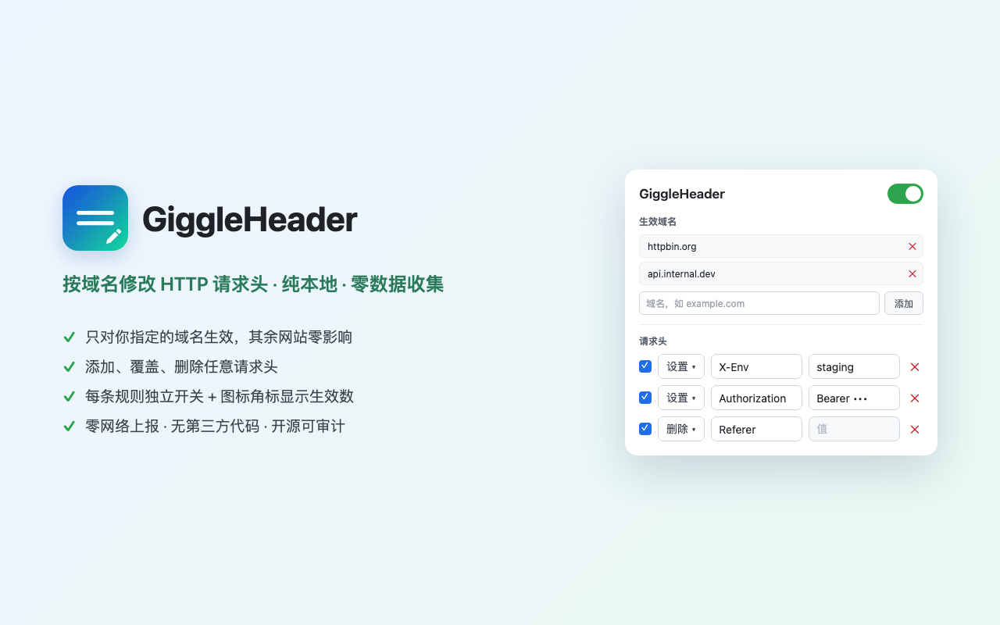

<div align="center">
  
  <h1>GiggleHeader</h1>
  <p>纯本地、零数据收集的 Chrome 扩展，按域名修改 HTTP 请求头。</p>
</div>



## 这是什么

一个极简的开发者工具，用于修改浏览器发出请求的 HTTP 请求头。只对你**显式授权的域名**生效，其余网站零影响。

它是常用工具 [ModHeader](https://modheader.com) 被下架后的一个**干净替代品**——纯本地运行、零数据收集、代码开源可审计。

## 特性

- **按域名生效**：只对你授权的域名（及其子域名）修改请求头，不碰其他网站。
- **三种操作**：添加 / 覆盖（set）、删除（remove）请求头。
- **独立开关**：每条规则可单独启用/禁用，另有全局总开关。
- **生效角标**：扩展图标实时显示当前生效的规则条数。
- **纯本地**：零网络上报、无第三方代码、无追踪，配置只存本机。

## 隐私

本扩展**不收集任何数据**。基于 Manifest V3 的 `declarativeNetRequest` API，扩展本身**无法读取**你的请求内容，只声明"如何修改请求头"，由浏览器执行。详见 [隐私权政策](PRIVACY.md)。

**权限说明：**

| 权限 | 用途 |
| --- | --- |
| `declarativeNetRequest` | 按配置修改 HTTP 请求头（核心功能） |
| `storage` | 在本机保存配置 |
| 可选主机权限 | 仅当你主动添加某域名时，才向该域名申请，用于对其请求生效 |

## 安装

**方式一（推荐）**：从 Chrome 应用商店安装（审核通过后上架）。

**方式二（开发者模式加载）**：
1. 下载/克隆本仓库。
2. 打开 `chrome://extensions`，开启右上角「开发者模式」。
3. 点「加载已解压的扩展程序」，选择本仓库目录。

## 使用

1. 点击工具栏的 GiggleHeader 图标。
2. 在「生效域名」里添加一个域名（如 `example.com`），在弹出的权限框点「允许」。
3. 在「请求头」里加一行：选操作（设置/删除）、填 Header 名与值。
4. 访问该域名下的页面，请求头即被修改；图标角标显示当前生效条数。

## 开发

```bash
npm test   # 运行纯函数单元测试（Node 内置 node:test，零依赖）
```

核心的「配置 → DNR 规则」翻译逻辑是纯函数（`src/rules.js` 的 `buildRules`、`src/domain.js` 的 `normalizeDomain`），不依赖 chrome API，可独立测试。

## License

MIT
